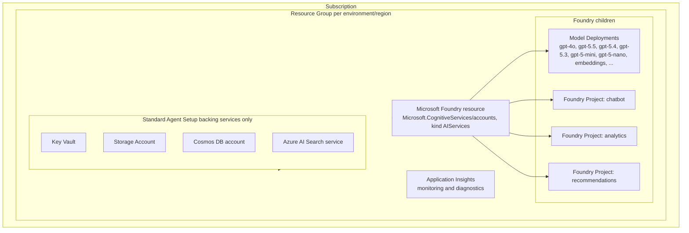
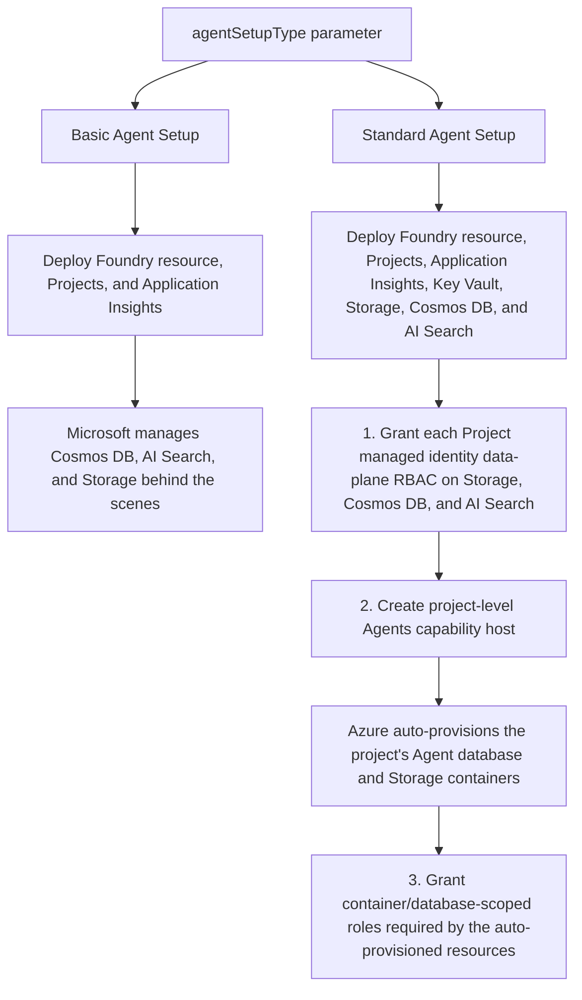
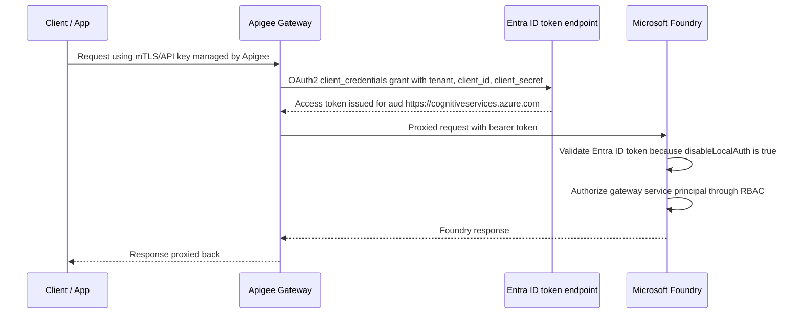

# Architecture Documentation

## 1. Purpose

This document describes the technical architecture of the Microsoft Foundry deployment automation framework: the Azure resource model, the Basic vs. Standard Agent Setup patterns, multi-region topology, RBAC/authentication design (including Entra ID-based authentication for API gateway integrations such as Apigee), and how the framework is intended to be reused across future Azure AI Foundry initiatives.

## 2. Resource Model

This framework deploys the **Microsoft Foundry resource model**:

- **Microsoft Foundry resource** — a `Microsoft.CognitiveServices/accounts` resource (`kind: AIServices`) with `allowProjectManagement: true`.
- **Foundry Projects** — child resources (`Microsoft.CognitiveServices/accounts/projects`) of the Foundry resource, one per business unit/team/workload (2-3 per environment in the reference parameter files, but the `projects` array supports any number).
- **Model Deployments** — child resources (`Microsoft.CognitiveServices/accounts/deployments`) of the Foundry resource, config-driven via the `foundryModelDeployments` array parameter (see §5).



## 3. Agent Setup Modes

The `agentSetupType` parameter (`Basic` | `Standard`, default `Basic`) controls whether Microsoft Foundry Agents use Microsoft-managed backing infrastructure or infrastructure owned and deployed by this framework:

| Mode | Backing infrastructure | When to use |
|------|------------------------|-------------|
| **Basic** | Microsoft manages Cosmos DB/AI Search/Storage automatically behind the scenes. Only the Foundry resource, Projects, and Application Insights are deployed. | Fastest path to a working environment; suitable for dev/test and workloads without strict data-residency/compliance requirements on Agent backing stores. |
| **Standard** | This framework deploys and owns Key Vault, Storage, Cosmos DB, and AI Search, wired to each Project via AAD-only `connections` resources and account/project-level Agents **capability hosts**. | Production workloads that need control over networking, backup/retention, cost allocation, and compliance for Agent thread storage/vector search/file storage. |

The following diagram summarizes how Basic and Standard Agent Setup differ, and the Standard-only deployment ordering that is enforced via `dependsOn` in `main.bicep`:



Standard Agent Setup deployment ordering:

1. Grant each Project's managed identity data-plane RBAC roles on Storage/Cosmos DB/AI Search (Storage Blob Data Contributor, Cosmos DB Operator, Search Index Data Contributor, Search Service Contributor).
2. Create the project-level Agents capability host (`Microsoft.CognitiveServices/accounts/projects/capabilityHosts`), which triggers Azure to auto-provision the Cosmos DB database and Storage containers used by that project's Agents.
3. Grant the container/database-scoped roles the capability host's auto-provisioned resources require (Storage Blob Data Owner scoped via an ABAC condition to `-azureml-agent`-suffixed containers; Cosmos DB built-in data-plane role scoped to the `enterprise_memory` database).

## 4. Authentication & RBAC

- **No API keys.** `disableLocalAuth: true` is set on the Foundry resource and (in Standard mode) on Key Vault, Storage, Cosmos DB, and AI Search. All access is via **Microsoft Entra ID (AAD)**.
- **System-assigned managed identities** on the Foundry resource and each Foundry Project are used for Azure-to-Azure RBAC (e.g., Foundry → Key Vault, Project → Cosmos DB).
- **`role-assignment.bicep`** is a generic, reusable module that resolves the target resource type from a resource ID and creates the appropriate `Microsoft.Authorization/roleAssignments` resource — used throughout the framework for Key Vault, Storage, Cognitive Services, Cosmos DB, and AI Search targets.

### 4.1 Entra ID Authentication via Apigee (API Gateway) Integration

For consumers that must call the Foundry resource through an enterprise API gateway (e.g., **Apigee**) rather than calling Azure directly, the framework provisions the Azure-side half of an Entra ID **client-credentials (OAuth2)** trust:



- `infra/modules/entra-app-registration.bicep` (via the Microsoft Graph Bicep extension) creates the **Entra ID App Registration + Service Principal** that Apigee uses as its OAuth2 client.
- `main.bicep` (gated by `deployApigeeIntegration = true`) grants that service principal the **Cognitive Services OpenAI User** role on the Foundry resource, using the same generic `role-assignment.bicep` module.
- **Apigee-side configuration is out of scope for Bicep** (Apigee is not an Azure resource) — configure an `OAuthV2`/`ServiceCallout` policy in Apigee to perform the client-credentials grant against `https://login.microsoftonline.com/<tenant-id>/oauth2/v2.0/token` using the `apigeeGatewayAppId` output (client ID) and a client secret/certificate you generate for that App Registration (`az ad app credential reset --id <appId>` — **do not commit secrets to source control**), then forward the resulting bearer token to the Foundry endpoint (`foundryEndpoint` output).
- This pattern generalizes to any Entra-ID-aware gateway, not just Apigee.

## 5. Configuration-Driven Model Onboarding

New models are onboarded **without any Bicep changes** by adding an entry to the `foundryModelDeployments` array parameter in the relevant environment's `.bicepparam` file:

```bicep
{
  name: 'gpt-5.5'              // deployment name (used in API calls)
  model: {
    name: 'gpt-5.5'            // underlying model name in the Azure AI Foundry model catalog
    version: '2026-04-23'       // model version
  }
  sku: {
    name: 'GlobalStandard'     // deployment SKU
    capacity: 50                // throughput units (TPM/RPM scale factor)
  }
}
```

`main.bicep` and `modules/foundry.bicep` treat this as a generic array (`@batchSize(1)` loop over `Microsoft.CognitiveServices/accounts/deployments`), so onboarding a model is a **pure parameter file change** — no module code changes, no new pipeline logic. The GitHub Actions workflow's `validate` stage will pick up the new deployment automatically on the next PR.

### 5.1 Lifecycle semantics

The `name` field is the resource identity; `model` and `sku` are mutable properties of that
resource. This determines what happens on redeploy:

| Change in `.bicepparam` | ARM behaviour |
|---|---|
| Add a new array entry | New deployment created; existing deployments untouched |
| Change `sku.capacity`, `sku.name`, `model.version`, or `model.name` (same `name`) | Existing deployment updated **in place** |
| Remove an array entry | **Nothing happens** — the live deployment persists (see below) |

Deployments run in ARM **Incremental** mode, which only creates and updates the resources present
in the template and never deletes resources removed from it. `Complete` mode would delete them,
but is not viable here: this is a *subscription-scoped* deployment, so Complete mode would delete
every resource group in the subscription absent from the template.

Deletion is therefore handled imperatively by the pipeline's **Reconcile model deployments** step,
which diffs the compiled parameter file against `az cognitiveservices account deployment list`
after every successful deploy. Orphans are reported as warnings by default and only deleted when
the `pruneOrphanedModels` workflow input is explicitly set — see `docs/deployment-guide.md` §5.1.

## 6. Multi-Region Deployment

The framework is **region-agnostic**: every resource name and the `location` parameter are supplied per `.bicepparam` file, and the Resource Group itself is parameterized (`resourceGroupName`). This means:

- Each environment (`dev`, `stg`, `prod`) can independently target any Azure region supported by Microsoft Foundry / Azure AI Foundry model availability.
- **Multiple regions for the same environment** are supported by adding another `.bicepparam` file following the same naming convention, pointed at a different `resourceGroupName`/`location` (see `infra/prod-secondary-region.main.bicepparam` for a working westus2 example alongside `infra/prod.main.bicepparam` in eastus).
- The GitHub Actions `deploy-manual` job accepts an optional `region` workflow input that overrides the `location` parameter at deploy time for ad-hoc regional deployments without needing a new `.bicepparam` file.
- **Traffic steering across regions** (active-active load balancing, active-passive failover) is **not** managed by this framework — that is an API gateway/Front Door/Traffic Manager concern layered on top (e.g., Apigee target endpoint routing, or Azure Front Door in front of both regional Foundry endpoints).
- Model **quota and regional availability differ per region** — always confirm target models are available in the target region before adding it to a new region's parameter file (`az cognitiveservices model list --location <region>`).

## 7. Reusability for Future Initiatives

The framework is intentionally modular so it can be reused as the standard IaC pattern for future Azure AI Foundry initiatives at Ford:

- **Environment-parameterized, not hardcoded** — every environment/region is a `.bicepparam` file; the orchestrator (`main.bicep`) and modules never change per environment.
- **Composable modules** — `infra/modules/*.bicep` are single-purpose and independently testable (`bicep build` per module), so a new initiative can reuse individual modules (e.g., just `role-assignment.bicep` + `foundry.bicep`) without adopting the entire framework.
- **Config-driven extension points** — new projects, new models, new regions, and Basic vs. Standard Agent Setup are all parameter changes, not code changes.
- **CI/CD is decoupled from the Bicep** — `.github/workflows/deploy-foundry.yml` is a thin orchestration layer (`validate` → `deploy-manual`) that can be copied to a new repository and repointed at new `.bicepparam` files with minimal changes.

## 8. Diagram Source

The Mermaid diagrams embedded in this document are the machine-readable source diagrams for the logical architecture. Keep them updated alongside the surrounding text so GitHub-rendered Markdown remains the source of truth.
